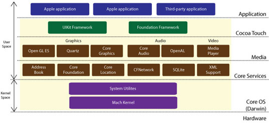
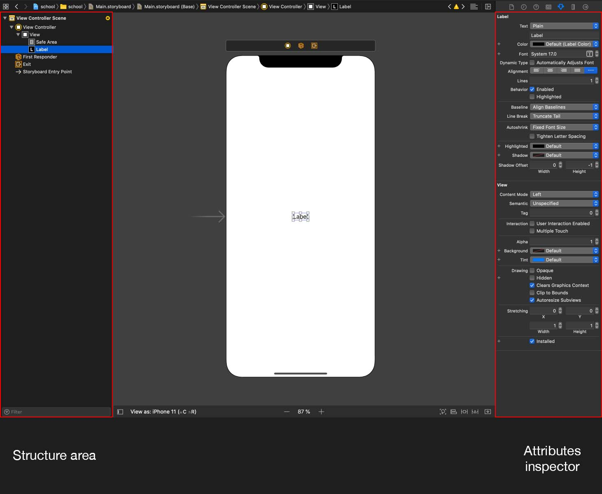
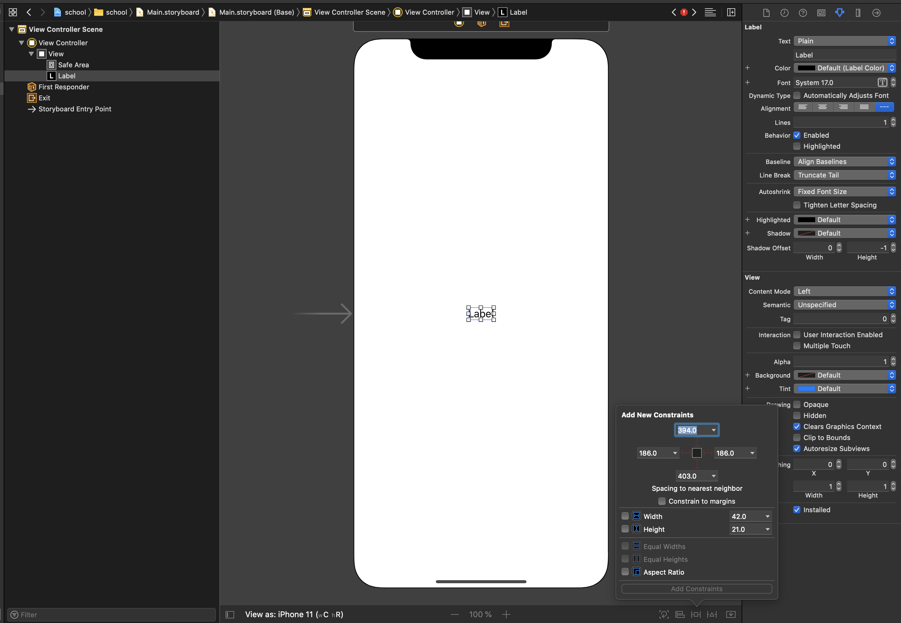
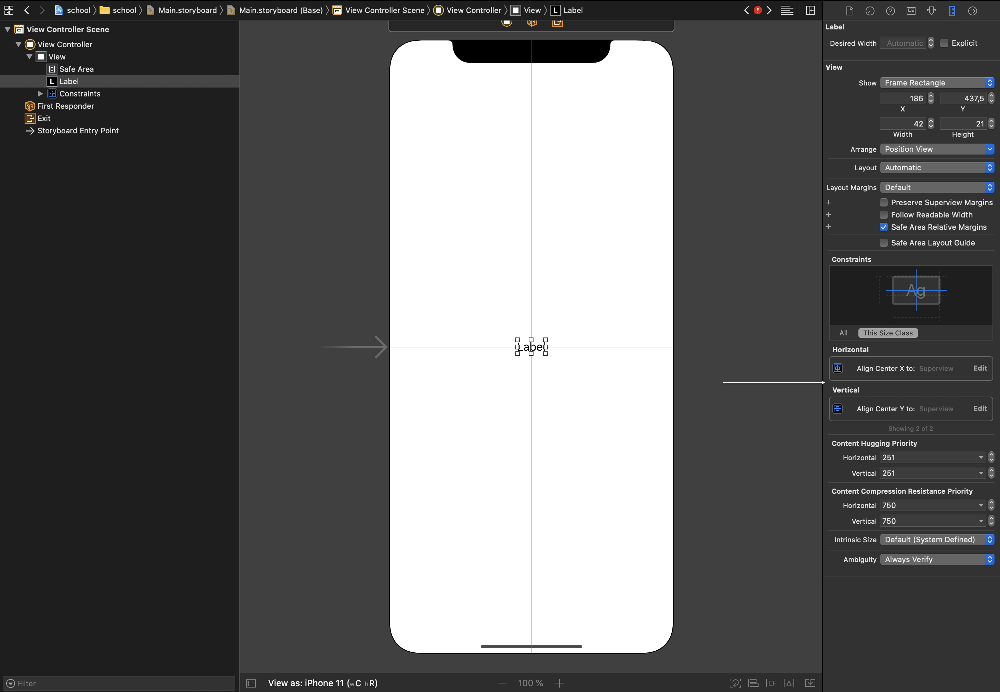
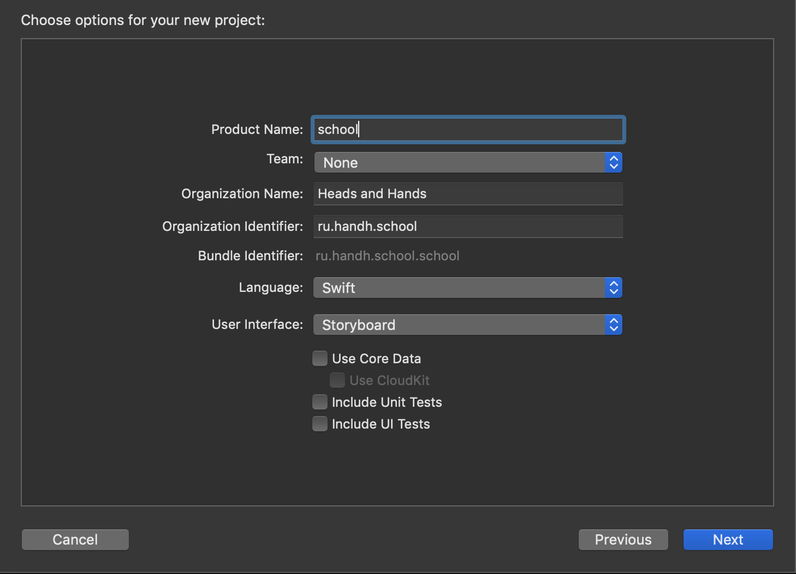

# ViewController и InterfaceBuilder

## Подготовка 

Прочитай про swift:
* [Основы](https://swiftbook.ru/content/languageguide/basics/)
* [Базовые операторы](https://swiftbook.ru/content/languageguide/basic-operators/)

## Урок 

### iOS SDK

Для создания приложения мы используем iOS SDK, текущая версия 13.0. Оно обратно совместимое, т.е. можем запускать на устройствах с операционкой предыдущих версий. Есть большое НО - нельзя использовать самые последнии фичи SDK, старые iOS их не поддерживают. 

СДК состоит из фреймворков, обрузующие "слоистую" структуру от высоко уровневых до низкоуровневых оберток над железом

Мы в используем: 
* UIKit - содержит всё что нужно для работы с UI (юзер интерфейс)
* Foundation - базовые типы, операторы, коллекции 

Для решения специфически задач могут потребоваться более низко уровневые фреймворки - например для работы криптографией.
Высокоуровневые имеет максимально простой синтксис, чем ниже тем сложнее

### UIKit

iOS приложение держится на 3 "китах":

1. UIView (вьюха/вьюшка) - элементарная визуальная единица, в ней реализованы:
* механизмы рассчета геометрии
* жизненный цикл
* рендеринг
2. UIWindow (окно) - окно нашего приложения, "удерживает" весь наш визуал приложения на экране. Как правило одно окно - одно приложение
3. UIViewController (контроллер) - как правило = экрану приложения, в нем реализованы
* механизмы жизненного цикла экрана
* обработка пользовательских действий
* бизнес логика экрана
* обновление вьюх на основе данных

### Xcode 

1. Toolbar - запуск/остановка сборки, состояние проекта, упревление видимостью других зон
2. Navigation area - файловая структура проекта, поиск, ошибки компиляции
3. Editor area - редактор файла, выбранный в navigation area
4. Utility area - настройки выбранного файла, или компонента в интерфейм билдере
5. Debug area - отображается при запуске проекта, вывод лог, отладка

### Interface Builder

Инструмент для верстки, содержащий зоны:
1. Structure area - структура сцены
2. Utility area
* Attributes inspector - меню для настройки компонентов
* Size inspector (справа от Attributes inspector) - настройка размеров и положения компонентов
* Identety inspector (слева от Attributes inspector) - указываем кастомный класс компонета
3. Редактор 

IB позволяет работать с файлам:
1. .xib - верстка вьюшек. В одном файле можно сверстать несколько экземпляров UIView, но как правило так ни кто не делает 
2. .storyboard - верстка экранов в целом и навигация между ними

Как работать с IB:
1. В toolbar жмем на кнопку `+`, в открывшемся меню ищем нужный компонет
2. Перетягиваем его на сцену, в примерно в нужное место 
3. В Structure area можно отредактировать расположение компонета в иерархии, если на втором шаге он добавился не туда
4. В Attributes inspector настраиваем свойства
5. В рядом с Attributes inspector есть меню Size inspector, там можно править положение и размеры компонета

> Важно! Если вам нужно добавить наследника какой-то вьюхи, на шаге (1) нужно выбрать базовый класс. Конечный класс указывается в Identety inspector меню

### UIView

Базовый класс для отображения чего либо на экране, в нем реализованны свойства и функции:
* alpha: `CGFloat` - прозрачность 
* isHidden: `Bool` - видимость элемента
* backgroundColor: `UIColor` - цвет фона
* transform: `CGAffineTransform` - аффиные преобразования 
* frame: `CGRect` - геометрическая рамка элемента (положение и размеры)
* bounds: `CGRect` - положение и размеры внутренней системы координат
* `func draw(_ rect: CGRect)` - функция рендеринга (на самом деле она нам не понадобиться)

Вьюшки можно "вкладывать" друг в друга, образуя вложенные иерархии. Для этого у нас есть функции и свойства:
* superview: `UIView?` - контейнер вьюхи
* subviews: `[UIView]` - все вложенные вьюхи
* `func addSubview(_ view: UIView)` - функция добавления вью
* `func removeFromSuperview()` - функция удаления

### Верстка

Верстка - процесс вычисления координат и размеров UI элементов на экране. Все координаты и размеры указываются в пойнтах (point / pt), 
которые преобразуются до физических пикселей,  путем домножения на scale экрана.  Доступные [разрешения](https://www.paintcodeapp.com/news/ultimate-guide-to-iphone-resolutions) экранов.

> Важно! Поинты должны ковертиться в целые числа. Пример, вы указали координаты `20.33`. Для на iphone 6+, преобразуется в `61`,  но на iphone 6 это будет `40.66`. У дисплея нет такого физического пикселя, и он не может закрасить часть себя нужным цветом. Для решения этой проблем, при рендеринге будут подключаться алгоритмы сглаживания, что может ударить по производительности и плавности интерфейса. 

Для верстки нужно сделать:
1. Выбрать подходящие компоненты из стандартной библиотеки UIKit или реализовать собственныеы
2. Выстроить иерархию вьюх
3. Настроить правила отображения (autolayout)

Autolayout - механизм автоматическом рассчета геометрии элементов для разных разрешений экранов и разного контента
Для этого используется класс `NSLayoutConstraint` - линейное уравнение вида:

`<View 1>.<Attribute 1> <Relationship> <Multiplier> * <View 2>.<Attribute 2> + <Constant>`,  где

* `<View 1>` и `<View 2>` - экземляр вьюх, может быть один и тот же экземляр
* `<Attribute 1>` и `<Attribute 2>` - то что хотим связать - границы (верх, лево, право, низ, центр) или размеры (ширина, высота)
* `<Relationship>` - тип связи = / >= / <=
* `<Multiplier>` и `<Constant>` - числовые константы

Пример:

На основе таких уравнений, образующих систему уровнений, происходит автоматический расчет frame и bounds. Но чтобы всё заработало, у всех экземляров UIView
нужно указать констрейнты положения (по горизонтали и по вертикали) и размеры (некоторые элементы сами рассчитывают размеры на основе контента). 
Как правило нужно указывать по 4 констрейнта на каждую вьюху.

С помощью констрейнтов можно:
* привязать границы геометрической рамки (лево, право, верх, низ)
* привязать центр по вертикали или по горизонтали
* указать жесткие размеры ширину и высоту
* связать размеры с другим элементом, например равенство по ширине
* настроить скалирование размеров

В интерфейс билдере констрейнты указываются вот этой менюшке

> Важно! При добавлении констрейнтов боковых отступов (лево, право, верх низ) через это меню, явно не указываются вторые участники уравнений. Поэтому будет использован ближайщий компонент

Каждый констрейнт можно настроить руками связав нужные элементы. Для этого выберите элемент. Зажав клавишу `control` ведите к нужному, 
отжав откроется конекстное меню выбора

Все добавленные констрейнты можно найти в Utility Area -> Size Inspector. Там же можно их отредактировать. 

> Важно! Избегайте дубликатов и взаимоисключающих условий

В SDK можно настраивать констрейнты с помощью  `Visual Format Language`. Его уже ни кто не успользует. 
Но с его помощью удобно проектировать и передавать информацию другим разработчикам. Пример записи:

`H:|-[BlueView]-8-[RedView(==80)]-|`, где 

* `H:` или `V:` - навравление (горизонтальное или вертикальное)
* `|` - граница супервью
* `-` стандартный отступ
* `[]` - указание вьюхи
* `(==80)` - кастомный размер, можно использовать неравенства
* `-8-` - кастомный отступ между элементами

В данном пример BlueView по ширине заполнит всё свободное пространство

## Занятие

### 1. Создай git репозиторий

1. Запусти `terminal`
2. Создай папку -  `mkdir school`
3. Перейти в папку -  `cd school`
4. Создай гит репозиторий - `git init`
5. Настрой гит игнор, файл со списком исключений, которые не должны индексироваться
- `vim .gitignore`
- нажми `i`, это переведет редактор в режим редактирования
- скопируй содержимое [файла](Resources/gitignore.md)
- нажми `esc` для вывода редактора из режима редактирования
- `:wq` сохранит файл
6. Добавь файлы в индекс - `git add .`
7. Закомить изменения `git commit -am"Initial commit"`

### 2.  Создай проект

1. Запусти `Xcode`
2. Открой меню создания проекта File -> New -> Project ... -> Single View App
3. Заполни поля 
4. Выбери папку которую создал в шаге 1.2
5. Удали файл `SceneDelegate`, он нам не понадобиться
6. Закомить изменения `git commit -am"Create project"`

### 3.  Расположить элементы согласно [дизайну](https://zpl.io/2vA8jPQ)

1. Открой файл `Main.storyboard`
2. Расположить элементы согласно дизайну, используя UI элементы:
* UILabel - вывод текста
* UITextField - поле ввода
* UIButton - кнопка

## Домашнее задание 

1. Изучи какими настройки, используемых компонентов, в меню IB Utility Area -> Attributes Inspector
2. Настрой внешний вид компонентов согласно дизайну

## Полезные ссылки

* [Frame vs Bounds](https://medium.com/@suragch/frame-vs-bounds-in-ios-107990ad53ee)
* [Математические основы Auto Layout](https://habr.com/ru/company/oleg-bunin/blog/437584/)
