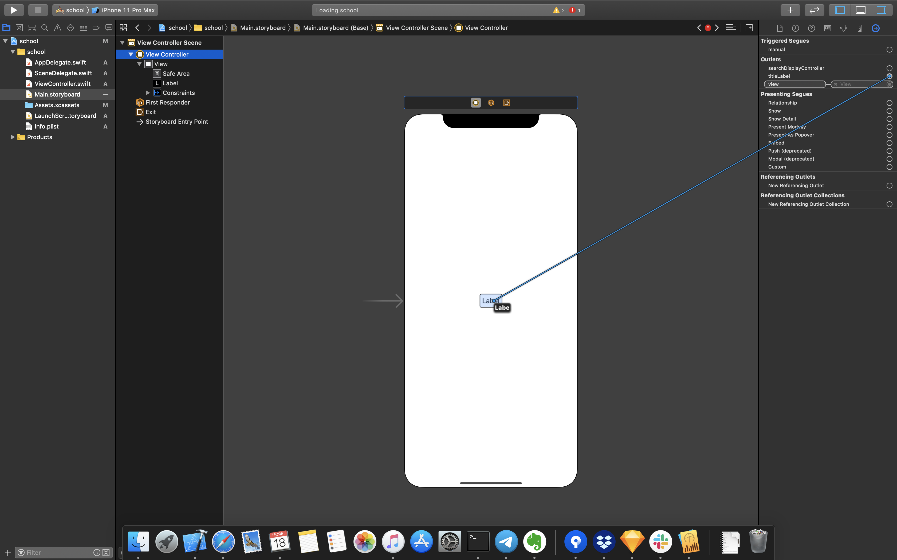
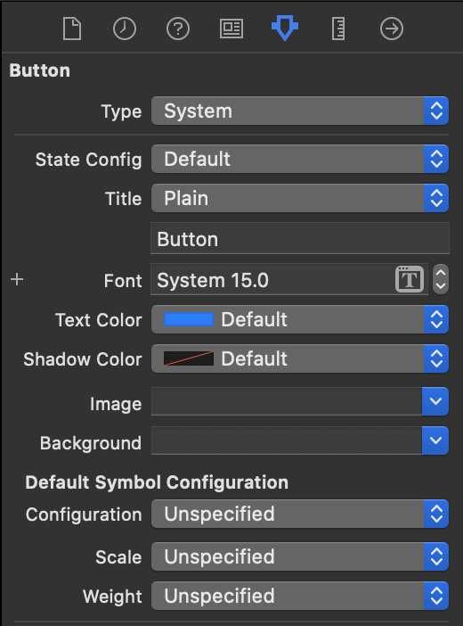
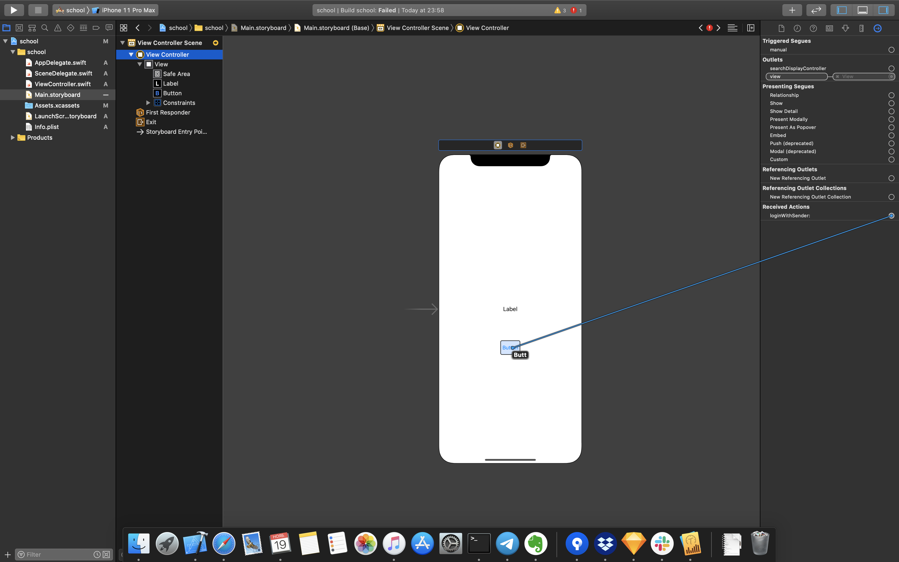
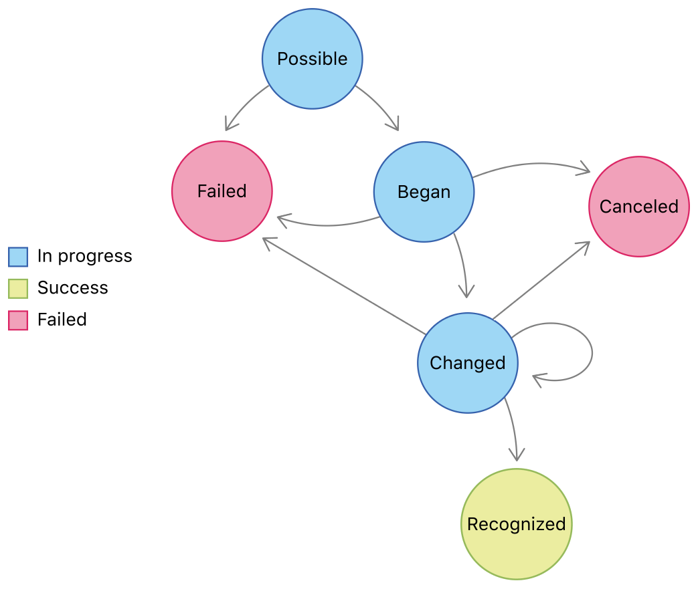

# Обработка пользовательских действий

## Подготовка 

Прочитай про swift:
* [Функции](https://swiftbook.ru/content/languageguide/functions/)
* [Классы и структуры](https://swiftbook.ru/content/languageguide/classes-and-structures/)
* [Свойства](https://swiftbook.ru/content/languageguide/properties/)

Паттерны:
* [Делегирование](https://ru.wikipedia.org/wiki/Шаблон_делегирования)
* [Команда](https://refactoring.guru/ru/design-patterns/command)
* [Цепочка обязанностей](https://refactoring.guru/ru/design-patterns/chain-of-responsibility)

## Урок 

### Линковка компонентов

Для получения доступа в коде к элементам, добавленных в IB, их нужно залинковать в класс UIViewController. Для этого нужно сделать:

1. В своем классе UIViewController укажи свойство `@IBOutlet weak var titleLabel: UILabel!`, где `@IBOutlet` специальный атрибут, который открывает IB доступ к этому свойству
2. Открой файл .storyboard
3. В structure area выбери сцену
4. В utility area открой Connection inspector
5. В открывшемся меню выбери нужный компонет и тяни к компоненту



> Важно! Можно линковать несколько элементов в одно свойство `@IBOutlet var labels: [UILabel]!`

> Важно! Для нейминга свойств суффикс базового класса: titleLabel, phoneTextField, loginButton

### UIResponder

Внутри этого класса организован механизм регистрации пользовательсих действий (жестов) и поиск того кто может это действие обработать. 
Этот этого класса унаследованы UIViewController, UIView, UIApplication (наше приложение). 
Поиск реализован при помощи паттерна "Цепочка обязанностей"

UIKit проходит через список UIResponder-ов и проверяет с помощью canPerformAction на наличие нашей функции.

`open func canPerformAction(_ action: Selector, withSender sender: Any?) -> Bool`

Если выбранный UIResponder не может работать с конкретным методом,
UIKit рекурсивно посылает действия к следующему UIResponder-у в списке с помощью метода target который возвращает следующего UIResponder-а.

`open func target(forAction action: Selector, withSender sender: Any?) -> Any?`

Этот процесс повторяется до тех пор, пока кто-то из UIResponder-ов сможет работать с нашим методом или список закончится и это событие система проигнорирует.

> `Selector` - это obj-c указатель на функцию 

Функция которую помещается в селектор, может принимать до 2-х параметров:
* `sender` - объект инициируйший событие, например экземляр кнопки или текстового поля,
* `event` - тач эвент

```
@objc func doSomething()
@objc func doSomething(sender: Any?)
@objc func doSomething(sender: Any?, event: UIEvent?)
```

> @objc - специальны модификатор, сообщающий компилятору что функция objc-шная

### UIControl

Наследник класса UIView, на его основе созданы UI компоненты (UIButton, UITextField, и т.д.), которые 
* обрабатывают действия пользователя
* имеют разные визуальные состояния

В экземляр этого класса мы можем добавлять или удалять функции, которые должны выполнить на нужные нам события 

```
open func addTarget(_ target: Any?, action: Selector, for controlEvents: UIControl.Event)
open func removeTarget(_ target: Any?, action: Selector?, for controlEvents: UIControl.Event)
```

Например, `loginButton.addTarget(self, action: #selector(login(sender:)), for: .touchUpInside)`,  мы сообщаем кнопке что на нажатия должна выполниться функция `login`, у экземляра `self` (указатель на себя), в нашем случае это экземляр класса ViewController.

Как это работает:
1. Пользователь нажал экран
2. UIKit через цепочку респондеров ищет компонент, который может обработать UIEvent (событие нажатия на экран)
3. UIKit нашел нашу кнопку
4. Наша кнопка под капотом, обрабатывает этот UIEvent, и определяет что именно произошло. Например, пользователь убрал палец с кнопки (`.touchUpInside`)
5. Кнопка вызывает все фукнции, которые были подписаны на этот эвент
6. Выполняется наш код

> Интересно! Если в функции `addTarget` не передавать `target`, т.е. передать `nil`, кнопка будет искать нашу функцию по средствам UIResponder chain

### UIControl.Event

* `touchUpInside` - эвент, который обычно используется для кнопок. Срабатывает после того как пользователь убирает палец с компонента
* `editingDidBegin` - эвент используется для текстовых полей. Уведомляет о старте редактирования текстового поля (установили фокус в поле)
* `editingChanged` - эвент используется для текстовых полей. Уведомляем об изменениях текста
* `editingDidEndOnExit` - эвент используется для текстовых полей. Уведомляем о нажатие кнопки return на клавиатуре
* и т.д.

> Интересно! UIControl.Event - это математическое множество, т.е. можно указывать подписывать на событие, которое объединяет несколько других одновременно

### UIControl.State

Наследники класса UIControl, могут изменять свой внешний вид в зависимости от своего состояния. Состояния:
* normal 
* selected
* highlighted
* disabled

Состояние может регулируется свойствами: 
* var isEnabled: Bool // default is YES. if NO, ignores touch events and subclasses may draw differently
* var isSelected: Bool // default is NO 
* var isHighlighted: Bool

Например, для кнопки в Attribute inspector меню можно для разных состояний указавать разный текст (строку, цвет, шрифт)   



> Важно! UIControl.State тоже математическое множество. Т.е. можем указывать цвет текста кнопки, когда она выбрана и подсвечена [.selected, .highlighted]

## Изменение порядка UIResponder Chain

Можно заставить компонент, при помощи `func becomeFirstResponder` стать первым UIResponder и вернуть его к старой позиции с помощью `resignFirstResponder`. Это часто используется с UITextField для показа клавиатуры которая будет вызвана, только когда UITextField является first responder-ом.

### Регистрация пользовательских действий

1. В своем классе UIViewController укажи функцию `@IBAction func login(sender: UIButton)`, где `@IBAction` специальный атрибут, который открывает IB доступ к этой функции
2. Открой файл .storyboard
3. В structure area выбери сцену
4. В utility area открой Connection inspector
5. В открывшемся меню найди свой фунции и тяни к компоненту
6. В открывашемся меню выбери типа эвента. Для кнопки Touch Up Inside



> Важно! Для нейминга функций нужно использовать глагол описывающий действия: login, save, clear.  Так же желательно использовать параметр sender, у этого объекта можно обновлять состояние при необходимости, не прибегая к стороним свойства

>  Важно! Одну фунцию можно подключить к разным объектам, если это необходимо. Например, разные текстовые поля могут использовать общую функцию `@IBAction func edit(sender: UITextField)`. Параметр `sender` поможет определить нужный сценарий обработки

> Важно! Логический блоки в коде нужно "отбивать" при помощи `// MARK: - User Actions`

### Требования по текстовым полям

* переходы между текстовыми полями по нажатию на кнопку return клавиатуры
* тип кнопки return клавиатуры: далее, готово
* тип клавиатуры в зависимости от контента текстового поля, если поле для ввода эмейла -> UIKeyboardTypeEmailAddress
* при отображении клавиатуры вводимое поле должно быть на виду, также должна быть возможность прокрутить контент, перекрываемый клавиатурой
* при тапе по пустому месту клавиатура должна закрывать

### Изменение поведения текстового поля (паттерн делегирования)

Через свойство delegate, экземляр текстового поля может передать вам принятия каких-то решений. 
Для этого нужно реализовать протокол UITextFieldDelegate и написать реализацию тех функций протокола которые вам необходимы

```
extension ViewController: UITextFieldDelegate {
    // Игнорируем ввод символа "1"
    func textField(_ textField: UITextField, shouldChangeCharactersIn range: NSRange, replacementString string: String) -> Bool {
        return string != "1"
    }
}
```

и сказать экземляру текстового поля, кто будет делегатом `someTextField.delegate = self`
Обычно с помощью этой штуки делает маску для ввода номера телефона.

> Протокол - это договор, какие свойства и функции могут быть у переданного объекта
> функции с атрибутом *optional* можно не реализовать, если они вам не нужны  

### Обработчики жестов 

Основные реализации: 
* UITapGestureRecognizer - нажатие
* UILongTapGestureRecognizer - долгое нажатие 
* UIPanGestureRecognizer - движение пальца по экрану
* UISwipeGestureRecognizer - смахивание по экрану

GestureRecognizer - UIControl без интерфейса (без UI). Когда создаем экземляр указываем кто и с помощью какой функции будет обрабатывать жест
`.init(target: Any?, action: Selector?)`. Для жеста следующие состояния:

* possible — рекогнайзер готов к работе
* began — начался распознаваемый жест
* changed — изменение состояния, например, движение пальца при скролле
* recognized (он же ended) — жест закончился
* cancelled — аналог touchesCancelled
* failed — жест не был распознан (например мы ожидали скролл двумя пальцами, но экрана коснулся лишь один)



Каждый раз когда меняется состояние, будет вызываться ваша функция. Поэтому обязательно используйте парамерт `sender: UIGestureRecognizer` (или тип вашего обработчика жестов), чтобы для фильтрации нужно эвента. 

```
func tap(sender: UITapGestureRecognizer) {
    switch sender.state {
        case .ended:
            // Some code
    }
}
```

## Занятие

1. В классе ViewController создай аутлет свойства для текстовых полей и кнопки
2. Залинкуй свойства в Main.storyboard
3. В классе ViewController заведи функцию для обработки нажатия кнопки
4. Залинкуй функцию в Main.storyboard
5. При помощи функции `print()` выведи содержимое текстовых полей в лог
6. В Main.storyboard добавь `UITapGestureRecognizer` 
7. В классе ViewController создай функцию для обработки обработки нажатия, и залинкую её в сториборде
8. Добавь реализацию закрытия клавиатуры по тапу, с помощью `view.endEditing(true)`

## Домашнее задание 

1. Настрой поведение текстовых полей согласно гайдам
2. Создай кастомный класс кнопки, добавь смену фона, переопределив свойство  `var isHighlighted: Bool`
3. Подключи свой класс в сториборде. Для этого выбери кнопку, открой Identity inspector menu в Utility Area и в поле Class укажи свой

Бонус: Загугли как добавлять свои свойства в IB, и добавь свойство `highlightedColor` для своего класса

## Полезные ссылки

* [Подробно про UIResponser](https://habr.com/ru/post/464463/)
* [Подробно про UIGestureRecognizer](https://medium.com/yandex-maps-ios/uigesturerecognizer-tutorial-83f2128e479d)
