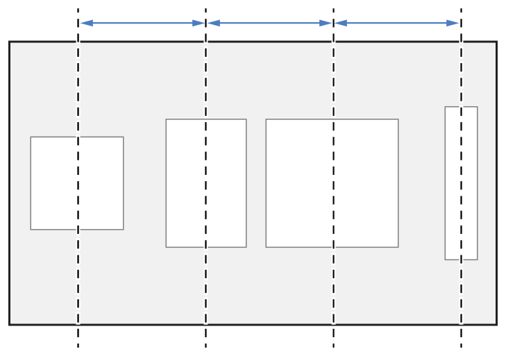

# UIScrollView и клавиатура

## Подготовка 

Прочитай про swift:
* [Замыкания](https://swiftbook.ru/content/languageguide/closures/)

Паттерны:
* [Наблюдатель](https://refactoring.guru/ru/design-patterns/observer)

## Урок 

### UIScrollView

С помощью этого класса можно:
* Показать контент, который не помещается полностью на экране
* Зумировать контент

> Интересно! Все эти эффекты достигаются при помощи изменения внутреней системы координат (bounds)


Свойства определяющее геометрию:
* contentInset - боковые отступы
* contentSize - размеры вашего контента
* contentOffset - смещения зоны контента относительно начала координат

> Важно! Для того чтобы содержимое скроллвью скролилось по горизонтали, необходимо чтобы contentSize.width + contentInset.left + contentInset.right были больше чем ширина самого scrollView. Аналогично для вертикали

Взаимодействия пользователя:
1. Когда пользователь касается контента внутри скроллвью, устанавливается флаг `isTracking = true`
2. Когда пользователь непрерывно двигает контент (скроллит), устанавливается флаг `isDragging = true`
3. Когда пользователь с усилием "толкает" контент с усилием, он продолжает двигаться с инерцией, в таком случае устанавливается флаг `isDecelerating = true`

> Важно! Когда контент движется по инерции и достигает рамок, по дефолту контент оттянется на какую-то величину в зависимости от значения инерции, а потом вернет контент так чтобы границы совпадали. Этот эффект называется bounсe

> Важно! Если содержимое меньше размеров скроллвью, но эффект оттягивания нужен, можно его принудительно включить при помощи свойств alwaysBounceVertical и alwaysBounceHorizontal

> Важно! У скроллвью поддерживает паттерн делегирования, для более тонкой настройки или создания дополнительных реакции на скролл. Например, паралакс эффекты в хедерах экранов

### UIScrollView и автолайаут

1. Добавь UIScrollView на вью, настрой констрейнты, определяющее положение и размеры компонента (обычно лево, право, верх, низ)
2. Добавь UIView на скроллвью (её обычно называют contentView), в неё будем добавлять контент
3. При помощи констрейнтов свяжи грани contentView и UIScrollView
4. Т.к. внутреннее содержимое UIScrollView ни как не ограничено, UIKit не может рассчитать frame contentView. Это решается:
* указанием констрейнтов размеров
* добавление жесткого ограничения горизонтали или вертикали, равенство высот или ширин, чтобы по противоложной оси размер вычеслился на основе содержимого contentView

На основе наших констрейнтов будет вычислен размер contentView, это и будет contentSize скроллвью

> Важно! Если вам нужно сверстать экран в IB, размеры которого больше размера доступных устройств, в size inspector меню UIViewController можно переключиться на freeform и указать нужные размеры

### UIStackView


Специальный класс, для управлением компоновки сразу нескольких элементов, объедененных в группу. Аналог LinearLayout на андройде.

> Важно! Некоторые свойства UIView не работают, например backgroundColor

Управление содержимым осуществляется при помощи свойств:
* axis - направление компоновки элементов (горизонтальная или вертикальная)
* distribution - правило компоновки элементов по выбраной оси
* alignment - правило компоновки элементов по противоположной оси
* spacing - расстояние между элементами

| Distribution  | Preview | Comment |
| -------- | ----------- | ----------- |
fill |  | Компоненты заполняют всё доступное пространство. Если элементы не помещаются, UIKit сжимает их в соотвествии с приоритетами
fillEqually |  | Компоненты поровну заполняют всё доступное пространство
fillProportionally |  | Компоненты заполняют доступное пространство вдоль оси. Размеры изменяются пропорционально на основе их собственного размера контента 
equalSpacing |  | Компоненты заполняют всё доступное пространство. Если элементы заполнили не всё, равномерно увеличивается расстояние между ними. Если не помещаются, UIKit сжимает их в соотвествии с приоритетами
equalCentering |  | Компоновка с сохранением расстояния между центрами элементов. Если элеметы не помещаются, UIKit сжимает их в соотвествии с приоритетами

> Чем отличается fillProportionally от fill? Например, у вас есть 3 лейбла. Для отображения текста нужно 300, 200, 100 pt. Стеквью будем использовать пропорцию 3:2:1, для компоновки элементов, чтобы они заполнили всё доступное пространство

| Alignment  | Preview | Comment |
| -------- | ----------- | ----------- |
fill |  | Элементы заполняют всё свободное пространство по противоположной оси
leading<br>trailing<br>top<br>bottom |  | Выравнивает элементы по грани
center |  | Выравнивание по центру
firstBaseline |  | Выравнивание по первой строке
lastBaseline |  | Выравнивание по последней строке

На основе этих правил UIStackView динамически создает все нужные констрейнты, избавляя нас от лишней работы. При выполнении программы можно добавлять, удалять элементы и управлять их видимостью (с помощью свойства `isHidden`).

> Важно! Без использования UIStackView, скрыв элемент, вы также выключите все его констрейнты. Как правило приводит к поломке всего лайаута.

### Приоритеты констрейнтов

У каждого констрейнта есть приоритет, со значением 0 до 1000. Согласно этому приоритету решаются уравнения. Если констрейнт конфликтует с более приоритетным, менее приоритетный будет проигнорирован. Например, `V:|[titleLabel]-[loginButton]`, мы хотим для короткого заголовка loginButton располагался по центру, но если текст будет большой, чтобы кнопка сместилась. Для этого у констрейнта centerY уменьшаем приоритет.

> Важно! У констрейнтов созданных в IB приоритет = 1000, у созданных в коде 999.

### Приоритеты сжатия и растяжения

Частая ситуация, когда элементы сжимаются или растягиваются не так как нам нужно.
Например, `H:|-[titleLabel]-[dateLabel]-|` заголовок вернулся очень большим, в таком случае dateLabel может схлопнутся до 0. Для решения подобных проблем у каждой вьюхи есть:
* `hugging priority` - сопротивление растяжению, элемент с наименьшим значением будет растянут, по дефолту = 250
* `compression resistance priority` -  сопротивление сжатию, элемент с наименьшим значением будет сжат, по дефолту = 750

Для разрешения конфликта в примере, у dateLabel нужно повысить сопротивление сжатию по горизонтали

В IB приоритеты можно изменять в Size inspector меню

### NotificationCenter

Специальный класс для передачи сообщений (уведомлений) от одного объекта нескольким другим.
Во всем приложении работаем с одним и тем же экземпляром - `NotificationCenter.default` (паттерн синглтон). 

Отправка сообщений:
```
NotificationCenter.default.post(name: Notification.Name("SomeEvent"), object: nil, userInfo: nil)
```
> object - выступает в качестве контекста, на случай если вы хотите фильтровать события
> userInfo - дополнительные данные

Прием сообщений:
````
NotificationCenter.default.addObserver(self, selector: #selector(handler(notification:)), name: Notification.Name("SomeEvent"), object: nil)

@objc func handler(notification: Notification) {
    // Some code
}
````
> В нашу функцию передается экземляр Notification, в котором содержатся все параметры указываемые при отправки сообщения (name, object, userInfo)

NotificationCenter используется для обработки событий объектов, к которым у нас нет прямого доступа. Например, системные события сворачивание приложения, показ/скрытие клавиатуры и т.д

> Не рекомендую строить логику приложения на NC, т.к. подобные решения неочевидные и сложно отлаживать в случае багов/ошибок 
 
### Обработка показа клавиатуры

Когда отображается клавиатура, нужно чтобы она не перекрывала контент. При этом мы не можем завязаться на жесткую константу, т.к. пользователь может установить кастомную, размеры которой будут отличаться от эталанной. Для этого мы подписываемся на события `keyboardWillShowNotification` и `keyboardWillHideNotification` в NotificationCenter

````
let center = NotificationCenter.default
center.addObserver(self, selector: #selector(keyboardDisplay(notification:)), name: UIResponder.keyboardWillShowNotification, object: nil)
center.addObserver(self, selector: #selector(keyboardDisplay(notification:)), name: UIResponder.keyboardWillHideNotification, object: nil)

@objc func keyboardDisplay(notification: Notification) {
    guard let userInfo = notification.userInfo else {
        return
    }

    guard let keyboardFrame = userInfo[UIResponder.keyboardFrameEndUserInfoKey] as? NSValue else {
        return
    }

    let keyboardHeight = keyboardFrame.cgRectValue.height

    UIView.animate(withDuration: 0.3) {
        self.scrollView.contentInset.bottom = keyboardHeight
        self.scrollView.verticalScrollIndicatorInsets.bottom = keyboardHeight
    }
}
````

Что тут происходит:
1. Мы подписались на системные события клавиатуры "начало показа клавиатуры" и "начало скрытия клавиатуры"
2. При обработке события извлекаем из него данные (фрейм в конце анимации)
3. Анимационно добавляем отступы снизу у скроллвью

## Занятие

1. Добавь новую сцену (экран) в Main.storyboard
2. Выбери новый контроллер и установи Attributes inspector меню галочку `Is initial View Controller`
3. Добавь UIScrollView и настрой для него констрейнты
4. Добавь вертикальный стеквью в UIScrollView и настрой констрейнты
5. Добавь текстовые поля (Имя, Фамилия, Дата рождения, и еще штук 5) и кнопку в стеквью
6. Проставь отсутствующие констрейнты
7. Залинкуй UIScrollView
8. Реализуй обработку системных нотификаций `keyboardWillShowNotification` и `keyboardWillHideNotification`

## Домашнее задание 

1. Доделать все то что не успели на предыдущих уроках
2. При обработке клавиатуры извлеките время анимации
3. При установке фокуса в текстовое поле контент нужно проскролить, таким образом чтобы он отображался по центру области от верха экрана до клавиатуры

Бонус: настрой изменение масштаба заголовка, при оттягивании контента сверху вниз. Чем сильнее оттянул, тем сильнее увеличил. Перемещение контента можно отследить при помощи функции делегата `scrollViewDidScroll`, а масштабирование при помощи аффиных преобразований.
