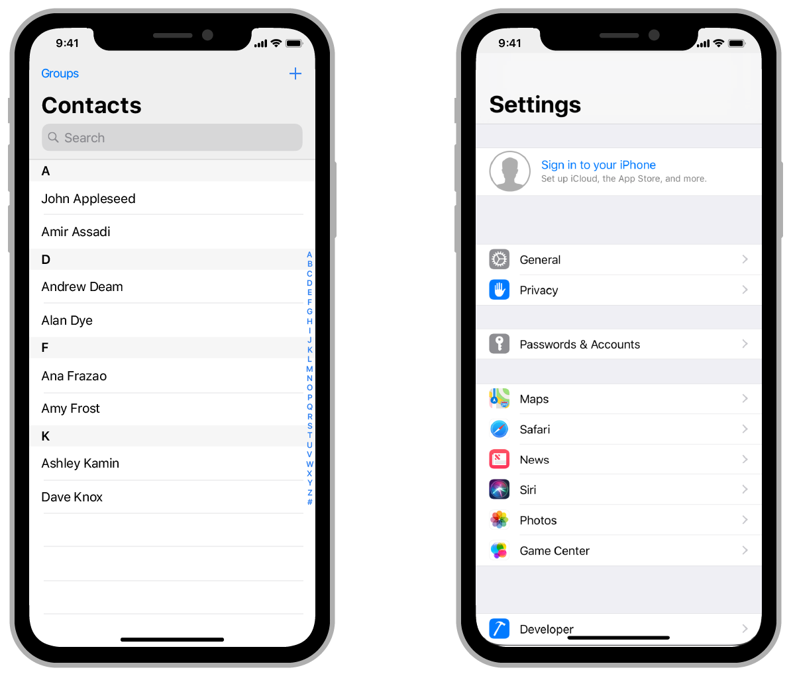
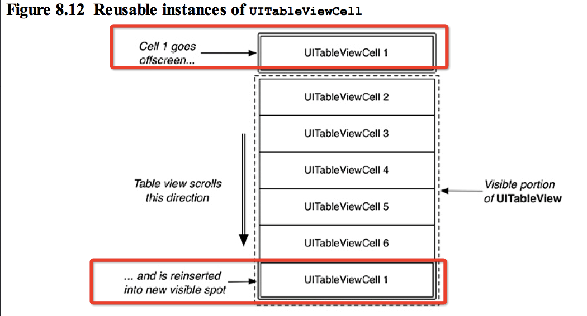

# UITableView и навигация

## Урок 

### UITableView

Это класс, наследник UIScrollView, для отображения вертикальных списков, состоящих из повторяющихся элементов. 
Пример, системные настройки, записная книжка



Структура таблицы:
*  `tableViewHeaderView: UIView?` 
* Section 0
* ...
* Section N
* `tableViewFooterView: UIView?`

Структура секции:
* Хедер секции
* Ячейка 0
* ...
* Ячейка N
* Футтер секции

Содержимое таблицы динамическое и настраиваются при помощи паттерна делегирования - `dataSource: UITableViewDataSource?`, т.е. права формирования содержимого таблица передает другому объекту.
Обязательны к реализации функции: 

````
// Возвращаем кол-во ячеек внутри секции
func tableView(_ tableView: UITableView, numberOfRowsInSection section: Int) -> Int

// Возвращаем экземляр ячейки
func tableView(_ tableView: UITableView, cellForRowAt indexPath: IndexPath) -> UITableViewCell
````
Все остальные функции опциональные (необязательные), их можно реализовывать по мере необходимости.
`IndexPath` - структура, определяющая порядок ячейки. Содержит свойства section - номер секции, row - номер ячейки в секции.  Нумерация начинается с 0. По дефолту используется одна секция.

### Как работать с таблицей

Для ячеек создаем наследника `UITableViewCell` и его верстку. Для футтера/хедера наследника `UITableViewHeaderFooterView`
Варианты верстки:
* кодом
* xib - (IB только с одной вью)
* сторибоарде

Созданные элементы регистрируются в таблице:

````
// Если ячейка сверстана в коде
func register(_ cellClass: AnyClass?, forCellReuseIdentifier identifier: String)

// Если ячейка сверстана в xib
func register(_ nib: UINib?, forCellReuseIdentifier identifier: String)
````

Для варианта со сторибордом, в Attributes inspector ячейки нужно указать поле Identifier. Для футтеров и хедеров аналогиные действия.
Далее настраиваем dataSource

````
extension ViewController: UITableViewDataSource {

    func tableView(_ tableView: UITableView, numberOfRowsInSection section: Int) -> Int {
        return 10
    }

    func tableView(_ tableView: UITableView, cellForRowAt indexPath: IndexPath) -> UITableViewCell {
        guard let cell = tableView.dequeueReusableCell(withIdentifier: "cellID") else {
            fatalError("Not found cell")
        }

        cell.textLabel?.text = "Section: \(indexPath.section) Row: \(indexPath.row)"

        return cell
    }
}
````

### Как работает таблица



При загрузке вьюхи или вызвав `reloadData` - таблица формирует:
1. внутреннюю модель данных (вызываются методы dataSource кол-во секций, кол-во ячеек в секции)
2. для полученной модели, вычисляются фреймы элементов ячейки/футтеры/хедеры (вызываются соответствующие методы delegate) 
3. заполняется видимая область таблицы функцией `cellForRowAt` (аналогичный метод для хедера и футтера)

При прокрутке списка, ячейки (футтер/хедеры), вышедшие за границы таблицы, отправляются в "буффер".
Когда потребуется показать новую ячейку, вызывается функция `cellForRowAt` - внутри которой вызывается `tableView.dequeueReusableCell(withIdentifier: "cellID")`. Она вернет ячейку из буффера или создаст новую.
Аналогично механизм и для хедера и футтера. 
Таким образом, для отображения списка с 1000 элементов, нам потребуется создать ~10 ячеек, который будут переиспользоваться

### Обновление таблицы

Для обновления содержимого таблицы можно вызывать функцию  `reloadData` . Для анимационного обновления используй:

````
func insertRows(at indexPaths: [IndexPath], with animation: UITableView.RowAnimation)
func deleteRows(at indexPaths: [IndexPath], with animation: UITableView.RowAnimation)
func reloadRows(at indexPaths: [IndexPath], with animation: UITableView.RowAnimation)
func moveRow(at indexPath: IndexPath, to newIndexPath: IndexPath)
````
> После вызова метода обновления,  будут вызваны методы датасоурса и делегата, в них должны возврщаться значения с учетом ваших измений. В случае не соотвествия произойдет краш.  
> Аналогичные функции есть для обновления секций целиком

Так же мы можем объединять несколько обновлений в одну транзакицию:

````
tableView.beginUpdates()

// Some updates

tableView.endUpdates()
````

> Важно! Обновление ячеек и секций в одной транзакции может вести себя нестабильно.

## Занятие

1. Добавь новую сцену (экран) в Main.storyboard
2. Выбери новый контроллер и установи Attributes inspector меню галочку `Is initial View Controller`
2. Создай новый класс для контроллера с именем `ProfileViewController`
3. Добавь UITableView и настрой для него констрейнты
4. Добавь UITableViewCell и сверстай содержимое
5. Создай кастомный класс ячейки, залинкуй все свойства
6. Настрой dataSource в `ProfileViewController`

## Домашнее задание 

1. Доделать все то что не успели на предыдущих уроках
2. Сверстать хедер таблицы
3. Самостоятельно изучить UINavigationController
4. Подключи UINavigationController в сториборд
5. При нажатии на хедер, должен происходить переход на экран авторизации
6. При нажатии на кнопку "войти" в  `ProfileViewController` через делегат, должны прилетать логин и пароль
