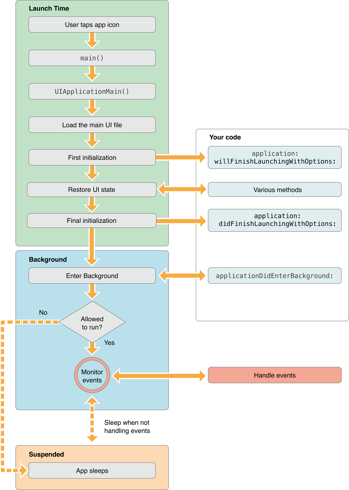
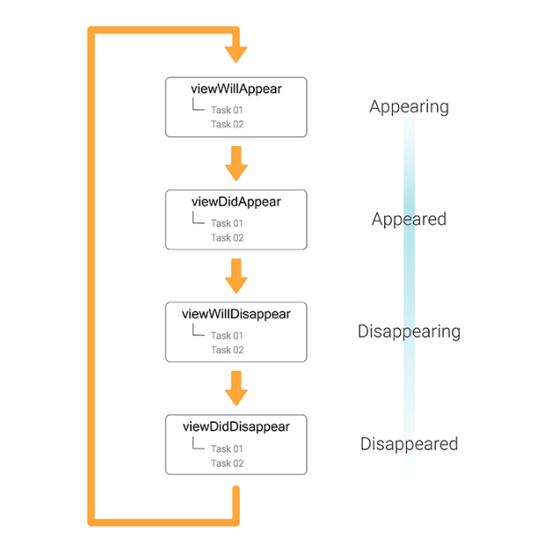
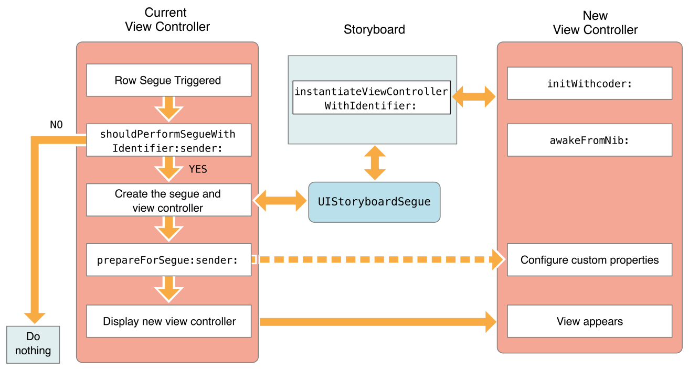
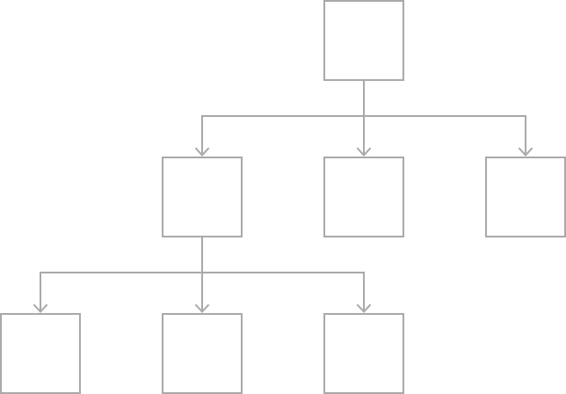
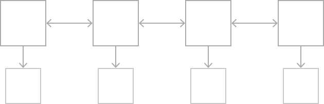

# Навигация

## Урок 

### Жизненный цикл приложения 



При запуске приложения, система создает экземляр класса `UIApplication`. 
Для разработчиков недоступна модификация этого класса (сделать наследника и переопределить какие-то методы и т.д.). Вся необходимая функциональность реализуется в классе  `AppDelegate` - делегат всего приложения, объект этого класса можно считать точкой входа в наше приложение. 

В `AppDelegate` прилетают эвенты (происходящие на уровне системы):
* запуска приложения
* сворачивание
* разворачивания
* пуши, диплинки, сири и т.д.

При запуске приложения в функции `didFinishLaunchingWithOptions`, нужно указать экземляр окна приложения с нужным контроллером

````
func application(_ application: UIApplication, didFinishLaunchingWithOptions launchOptions: [UIApplication.LaunchOptionsKey: Any]?) -> Bool {

    window = {
        let window = UIWindow()
        window.rootViewController = UIViewController()
        window.makeKeyAndVisible()
        return window
    }()

    return true
}
````

Не нужно этого делать при использовании сторибордов, система сделает всё сама.

### Жизненный цикл контроллера

При выполнении функции `window.rootViewController = UIViewController()`, происходит следующее:

1. Инициализация контроллера
2. `func loadView()` - вызывается, при первом обращении к свойству `view`. Эту функцию можно переопределять, устанавливая свой экземпляр корневой вьюхи 
3.  `func viewDidLoad()` - вызывается, когда view готово к использованию, все аутлеты проинициализированны и залинкованы 
4. `func viewWillAppear(_ animated: Bool)` - вызывается перед добавлением на дисплей (окно)
5. `func viewDidAppear(_ animated: Bool)` - вызывается после добавления на дисплее

> Важно! Если в `loadView` - указать свой собственный экземпляр, то иерархия созданная в IB будет проигнорированна

Если мы захотим изменить `rootViewController` у окна, то произойдет следующее:
1. У текущего будет вызвана `func viewWillDisappear(_ animated: Bool)`
2. Далее методы указанные выше для нового контроллера
3. У старого будет вызвана `func viewDidDisappear(_ animated: Bool)`



### UIStoryboardSegue

Класс для создания навигации в сторибордах. Состоит из:  
* `var identifier: String?` - уникальный идентификатор
* `var source: UIViewController` - контроллер с которого инициируется переход
* `var destination: UIViewController` - контроллер на который хотим попасть
*  `func perform()` - функция с логикой перехода.

Мы можем создавать своих наследников этого класса. И реализовывать свою  логику переходов,  переопределив функцию `perform` 

Как настраивать сегвеи в IB:
1. Выбери исходный контроллер в Structure Area
2. Зажав клавишу **control**, тяни к конечному контроллеру
3. Отжав курсор, в открывшемся меню выбрать нужный вариант (например Show)
4. Должна появиться линия соединяющая 2 контроллера
5. Выбери её, в Attributes inspector меню укажи Identifier

Перейти на нужный экран можно вызвав функцию:

````
performSegue(withIdentifier: "someID", sender: indexPath)
````


Передать данные и как-то дополнительно настроить экран можно в
````
func prepare(for segue: UIStoryboardSegue, sender: Any?)
````

> Важно! Сегвеи используются только в связке со сторибордами

### Дочерние контроллеры

Внутрь одного контроллера, можем вкладывать другие контроллеры. 
Тем самым можно разделять один крупный контроллер на несколько маленьких

Добавление:
````
addChildViewController(yourViewController)
view.addSubview(yourViewController.view)
yourViewController.didMove(toParentViewController: self)
````

Удаление:
````
yourViewController.willMove(toParentViewController: nil)
yourViewController.view.removeFromSuperview()
yourViewController.removeFromParentViewController()
````

Для добавления дочернего контроллера в IB, используется элемент UIContainerView и embed segue

### UINavigationController
 
Это специальный класс Controller для реализации навигации (один из примеров использования дочерних контроллеров). При переходе на экран, он помещается на в стек экранов UINavigationController и замещает текущий экран на дисплее устройства.
Добавлять новые экраны в стек можно до тех пор пока не закончится ресурсы (оперативная память) устройства.

Отличительный черты:
* `UINavigationBar` вьюха сверху экрана с кнопкой назад и заголовком экрана
* свайп назад 

С помощью этого контроллера реализуются переходы:
* push - переходы на следующий экран 
* pop - возвращение на предыдущий экран, при этом тот экран с которого ушли выгружается из памяти
* popToRoot - возвращение на главный экран
* setViewControllers - установить стек



### UITabBarController

Еще один пример родительско-дочерних связей. Класс реализует плоскую навигацию. В контроллер передается пулл контроллеров (табы). Между которыми можно переключаться

Отличительные черты:
* `UITabBar` - вьюха снизу экрана. Содержит иконки и заголовки, для обозначения раздела

Переключение табов происходит нажатием на "таб" в таббаре или программно selectedTab 

> Важно! Внутри таба может содержаться стек, или свои кастомные реализации навигации

> Очень важно! При переключении табов, скрытые экраны не выгружаются из памяти. Т.е. если у вас в каждом будет по 100 экранов стеке нав контроллеров, они все будут удерживаться в памяти



При комбинации UITabBarController + UINavigationController, на уровне системы реализован hot key - нажатие на текущий таб очистит стек открытого UINavigationController до главного

## Занятие

1. В сториборде сделать контроллер для неавторизованного пользователя (только шапка)
2. Подключить его в качестве дочернего в `ProfileViewController`
3. В коде добавить его на экран в качестве хедера таблицы
4. Добавить обработку нажатия, по которой происходит переход на экран авторизации

## Домашнее задание 

1. Доделать все то что не успели на предыдущих уроках
2. Добавить UIStackView c 2-мя UIContainerView 
3. Настрой в одном дочернем контроллере хедер для не авторизированного пользователя
4. Настрой в другом дочернем контроллере хедер для авторизированного пользователя
5. Залинкуй объекты,  во viewDidLoad установи UIStackView в качетсве хедера таблицы. Скрой хедер авторизированного пользователя 
5. Добавь в сториборд UINavigationController, сделай его стартовым
6. Настрой нажатие (UITapGestureRecognizer) на хедер не авторизированного пользователя, открывающее (push) экран авторизации
7. Настрой делегирование между экранами авторизации и профилем, переопределив функцию `func prepare(for segue: UIStoryboardSegue, sender: Any?)`
8. Настрой кнопку войти на экране авторизации, делегирующая событие экрану профиле
9. Настрой обработку авторизации на экране профиля - изменение видимости вьюх внутри стек вью, возврщение на экран профиля navigationController.popToRoot

## Полезные ссылки

* [Автолайаут дочерних вью контроллеров](https://useyourloaf.com/blog/self-sizing-child-views/)
